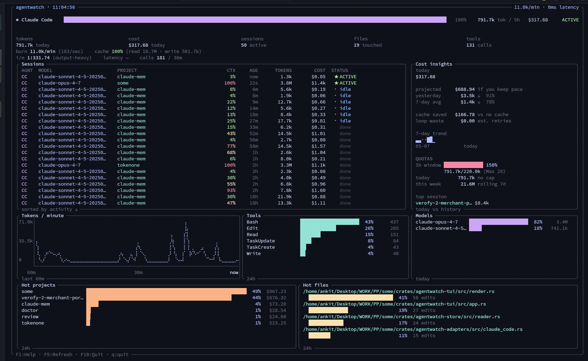

<pre align="center" style="color:#94e2d5">
     ▗▄██▙▄▄▟██▄▖          █████╗  ██████╗ ███████╗███╗   ██╗████████╗██╗    ██╗ █████╗ ████████╗ ██████╗██╗  ██╗
  ▄▟██████████████▙▄      ██╔══██╗██╔════╝ ██╔════╝████╗  ██║╚══██╔══╝██║    ██║██╔══██╗╚══██╔══╝██╔════╝██║  ██║
▗█▀▘▗ ▝▜██▀▀██▛▘▗▖▝▀█▖    ███████║██║  ███╗█████╗  ██╔██╗ ██║   ██║   ██║ █╗ ██║███████║   ██║   ██║     ███████║
█▌ █▘   ▜█▄▄██ █▘   ▐█    ██╔══██║██║   ██║██╔══╝  ██║╚██╗██║   ██║   ██║███╗██║██╔══██║   ██║   ██║     ██╔══██║
▜█▖    ▗█▌  ▐█▖    ▗█▛    ██║  ██║╚██████╔╝███████╗██║ ╚████║   ██║   ╚███╔███╔╝██║  ██║   ██║   ╚██████╗██║  ██║
 ▝▜████▀▘    ▝▀████▛▘     ╚═╝  ╚═╝ ╚═════╝ ╚══════╝╚═╝  ╚═══╝   ╚═╝    ╚══╝╚══╝ ╚═╝  ╚═╝   ╚═╝    ╚═════╝╚═╝  ╚═╝

                          htop for AI coding agents  ·  local-first  ·  MIT
</pre>

<p align="center">
  
</p>

<p align="center">
  <code>curl -fsSL https://agentwatch.sh | sh</code>
  &nbsp;·&nbsp;
  <code>irm https://agentwatch.sh/install.ps1 | iex</code>
  &nbsp;·&nbsp;
  <code>cargo install agentwatch</code>
</p>

# agentwatch

> Detects every AI coding agent on your machine and tracks them in one place. Zero config. Token windows, rate-limit predictions, beautiful local TUI. Works with Claude Code, Codex CLI, Cursor, Gemini CLI, Windsurf, OpenCode, and Claude Desktop.

## Why

You run `agentwatch`. It scans your machine, finds whichever AI coding agents you actually use, and starts tracking them. No accounts. No config files. No "which agents do you have?" dialog. It just works.

You see your 5-hour rate-limit window, your weekly cap, and a predictive runway clock that says **"at this burn rate you'll hit your limit in 47 minutes — slow down."** You see which tool calls and which file reads are eating your tokens. You see your one primary agent in deep-dive mode if that's all you use, or a side-by-side comparison if you bounce between two, or an aggregated grid if you're a 5-tool power user — the TUI adapts to your reality.

- **Zero config.** Auto-detects what you have. New agent installed? Picked up automatically.
- **Token windows + predictions.** Pro/Max users hit rate-limit walls, not bills. We surface the wall and the time to it.
- **Cost mode for API users.** Running raw SDKs? Toggle to $-primary view with one keystroke.
- **Live, local, free.** TUI updates as your agents work. Nothing leaves your machine. MIT.

## Supported agents

| Agent | Status | Captures |
|---|---|---|
| Claude Code (CLI) | full | tokens, tool calls, file edits, model, plan-aware 5h + weekly windows |
| Codex CLI (OpenAI) | full | tokens, tool calls, model |
| Cursor | partial | model + approximate tokens |
| Gemini CLI (Google) | full (planned) | tokens, tool calls, model |
| Windsurf | full where exposed | tokens, tool calls, model |
| OpenCode | full | tokens, tool calls, model |
| Claude Desktop | TBD | pending first inspection |
| GitHub Copilot | not supported | Copilot does not expose tokens locally — pending upstream |
| Direct API (Anthropic / OpenAI / Google) | full | via opt-in `agentwatch proxy` mode |

## Install

**Linux · macOS · WSL2**

```sh
curl -fsSL https://agentwatch.sh | sh
```

**Windows** (PowerShell)

```powershell
irm https://agentwatch.sh/install.ps1 | iex
```

**Rust toolchain** (any platform with `cargo`)

```sh
cargo install agentwatch
```

**Manual** — grab a prebuilt binary for your platform from [Releases](https://github.com/ankit-aglawe/agentwatch/releases) and drop it on your `$PATH`.

### What the installer does

Detects your OS + architecture, downloads the matching prebuilt binary from GitHub Releases, verifies its SHA-256 against the published checksum, and drops it in `~/.local/bin` (or `%LOCALAPPDATA%\agentwatch\bin` on Windows). It prints what it's about to do before doing it — no silent pipe-to-shell. Override the install dir with `AGENTWATCH_INSTALL_DIR=...`.

### Updating

```sh
agentwatch update         # self-update to the latest release
```

## Quick start

```sh
agentwatch                    # live TUI
agentwatch serve              # opens localhost:7878 dashboard
agentwatch demo               # synthetic data, see the product before you have history
agentwatch report --week      # plain-text weekly report
agentwatch summary --week     # markdown narrative weekly summary
agentwatch doctor             # detect installed agents + capability badges
```

## License

MIT.
